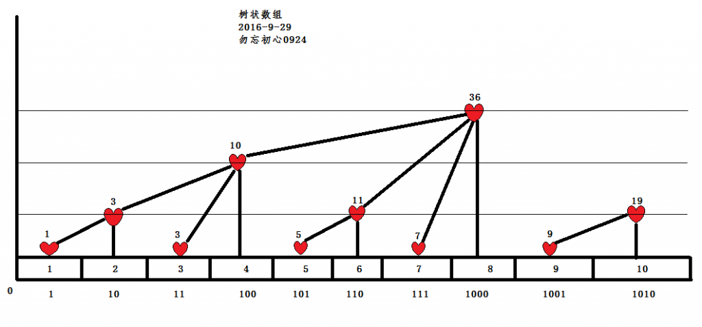

### 前言

刚刚我们学完了堆([戳我](http://ljfcnyali.coding.me/2017/08/30/%E9%87%8D%E6%96%B0%E5%AD%A6%E4%B9%A0%E2%80%94%E6%95%B0%E6%8D%AE%E7%BB%93%E6%9E%84%E4%B9%8B%E5%A0%86/))，今天我们就要来开始学习树状数组。

对于一个数组，如果我们需要了解这个数组里面的值为多少，时间复杂度为$O(1)$，求和的时间复杂度为$O(n)$，显然，当n很大的时候就不好办了。

那么，我们有什么办法来加快呢？众所周知的树状数组&线段树就是我们的解决方法。

现在都有线段树了，我们要树状数组干什么呢？树状数组可以做的事线段树都可以做，树状数组不能做的事线段树也可以做。

这个时候，我们就可以发现，树状数组的常数比线段树小了很多，而且代码复杂度也很容易。
好了，现在我们就可以开始介绍树状数组了。

<!--more-->

### 树状数组

#### 定义
树状数组是一个查询和修改复杂度都为$O(log_2n)$的数据结构，假设数组$a[1\cdots n]$，那么查询$a[1]+\cdots+a[n]$的时间是$O(log_2)$级别的，而且是一个在线的数据结构，支持随时修改某个元素的值，复杂度也为$O(log_2)$级别。我们一般使用树状数组来进行单点更新，区间求和，如果要做更复杂的事我们都使用线段树。

#### 树状数组的构造

如上图所示（摘自[勿忘初心0924](http://www.cnblogs.com/wuwangchuxin0924/p/5921130.html))的博客，树状数组是以二进制末尾零的个数多少来构建的。

#### 修改元素

从图中能看出来每一个数的父节点就是右边比自己末尾零个数多的最近的一个，通过一大堆莫名其妙的化简，$x\&(-x)$就能得出自己末尾0的个数。

例如$10(-10)=(0010)_2$。每一个节点保存的就是以他为根节点的数的和，这样就得出来了更新树状数组的函数：
```C++
void update(int x, int num) {
//x为要加num的节点，如果是减num变成负数即可
    while ( x <= n) {
        a[x] += num;
        x += lowbit(x);
    } 
}
```

#### 区间求和

快速修改我们已经做到了，那么我们如何进行快速求和呢？

实际上树状数组维护的是数组的前缀和，比如$sum(x)$就是$a[x]$的前缀和，想查询$[l,r]$区间的元素和只需要求出来$sum(r)-sum(l-1)$，这里的sum函数十分的神奇：
```C++
int getsum(int x) {
    int ans = 0;
    while ( x > 0) {
        ans += c[x];
        x -= lowbit(x);
    }
    return s;
}
```

### 后记

树状数组我们今天就学到这里了，如果还有不理解的我们可以在接下来的习题中找到属于自己的风采！